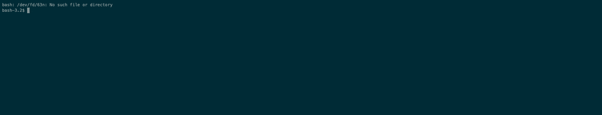

# Gradle Upgrade Interactive

[](https://travis-ci.org/kevcodez/gradle-upgrade-interactive)
[](https://www.npmjs.com/package/gradle-upgrade-interactive)

CLI to interactively upgrade Gradle dependencies, inspired by yarn.



Easily upgrade your dependencies and Gradle itself by simply selecting what you want to upgrade.

## Requirements

- NodeJS 10+
- [gradle-versions-plugin](https://github.com/ben-manes/gradle-versions-plugin)

## Installation

To get the data for the outdated dependencies, the [gradle-versions-plugin](https://github.com/ben-manes/gradle-versions-plugin) is required.

build.gradle

```groovy
plugins {
  id "com.github.ben-manes.versions" version "0.22.0"
}
```

Install the CLI

```sh
npm i -g gradle-upgrade-interactive
```

## Usage

Simply run `gradle-upgrade-interactive`.

## How it works

The [gradle-versions-plugin](https://github.com/ben-manes/gradle-versions-plugin) is called to generate a JSON report containing the outdated dependencies.
The CLI will then prompt all outdated dependencies and the selected dependency upgrades will be written to the Gradle build file.
